<!-- <p align="center">
  
</p>

<h2 align="center"> 👋 Welcome to my GitHub! </h2>

<p align="center">
  I am a software engineer focused on [Your Interest, e.g., Web Dev / AI / Systems]. 
  I love building tools that solve real-world problems.
</p>

---



### 🛠️ Tech Stack
<p align="center">
  
  
  
</p> -->

<!--START_SECTION:waka-->

```txt
No activity tracked
```

<!--END_SECTION:waka-->


