<h2 align="center"> 👋 Hi, I'm Kyrian! </h2>

<p align="center">
  I am a CS student at the University of Bristol.
</p>
<p align="center">
  <a href="https://www.kyriansalas.com"></a>
  <a href="https://www.linkedin.com/in/kyriansalas/"></a>
</p>

---

### Tech Stack
<p align="center">
  
  
  
  
  
  
</p>

### Activity & Stats

<!-- <p align="center">
  <picture>
    <source media="(prefers-color-scheme: dark)" srcset="./profile/top-langs-dark.svg">
    <source media="(prefers-color-scheme: light)" srcset="./profile/top-langs-light.svg">
    
  </picture>
</p> -->
<!--START_SECTION:waka-->

```txt
TypeScript   4 hrs 39 mins   █████████▓░░░░░░░░░░░░░░░   39.14 %
Python       2 hrs 26 mins   █████░░░░░░░░░░░░░░░░░░░░   20.51 %
Go           1 hr 44 mins    ███▓░░░░░░░░░░░░░░░░░░░░░   14.64 %
JavaScript   40 mins         █▒░░░░░░░░░░░░░░░░░░░░░░░   05.63 %
Other        36 mins         █▒░░░░░░░░░░░░░░░░░░░░░░░   05.17 %
```

<!--END_SECTION:waka-->
---